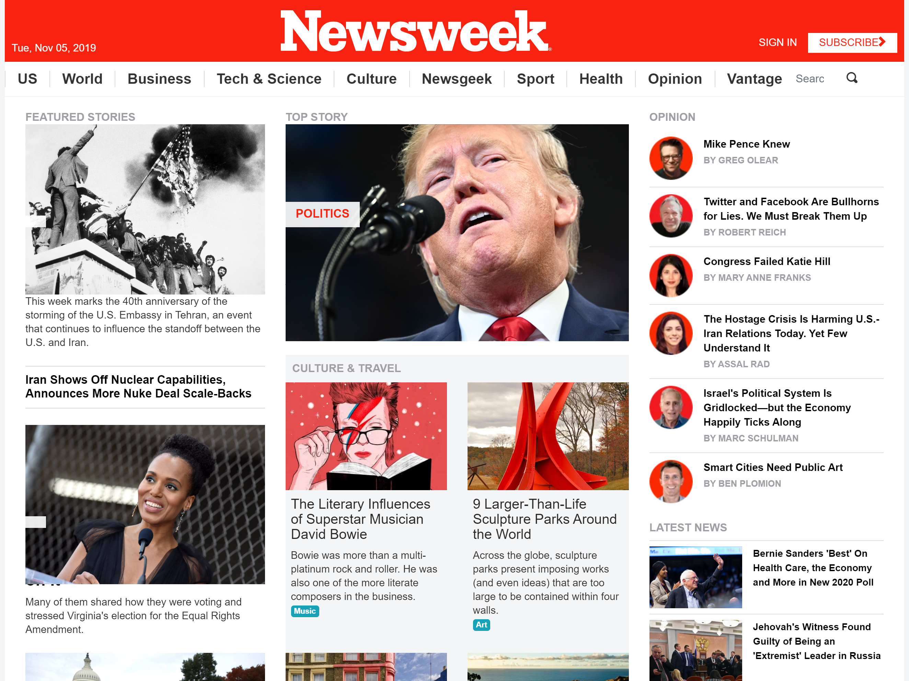

<!-- PROJECT LOGO -->

 

   <h3 align="center">The NEWSWEEK home page</h3>

  

    A simple clone page of The NEWSWEEK home page.
         
     
    ·
     <a href="https://rawcdn.githack.com/genzaraki/nwclone/ebc8364a0271dcb157369ca3c1b0a07ac9985e27/index.html">View Demo</a>
    ·    
  

<!-- TABLE OF CONTENTS -->
## Table of Contents

* [About the Project](#about-the-project)
  * [Built With](#built-with)
* [Contact](#contact)
* [Acknowledgements](#acknowledgements)

<!-- ABOUT THE PROJECT -->
## About The Project

  This project is part of the Microverse Project and is done  according to the required specifications.  

### Build With

* [Html]()
* [CSS]()
* [VSCODE]()

### Contact
* Amadou - [@tigamadou](https://twitter.com/tigamadou) - [LinkedIn](https://www.linkedin.com/in/amadou-ibrahim-75769167) - [GitHub](https://github.com/genzaraki)

* Project Link [https://github.com/genzaraki/nwclone](https://github.com/genzaraki/nwclone)

### Acknowledgements

* [GitHub](https://github.com)
* [VSCODE]()
* [StyleLint]()
* [Stickler]()
